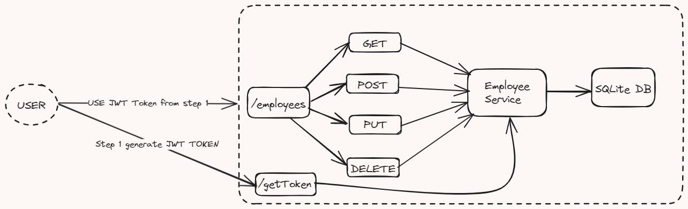

### Steps to run the application
1. Install required libraries 
    run `pip install -r requirements.txt`
2. Run the app 
    `python app.py`

#### Steps to use the APIs
1. Generate JWT Token 

    `curl  -X GET 'http://127.0.0.1:5000/getToken'`

2. Create an employee

    `
    curl  -X POST \
  'http://127.0.0.1:5000/employees' \
    --header 'Accept: */*' \
    --header 'Authorization: Bearer <REPLACE WITH JWT TOKEN>' \
    --header 'Content-Type: application/json' \
    --data-raw '{
    "name": "EmployeeName",
    "designation": "Software Engineer"
    }'
    `

3. Get all employees 

    `
    curl  -X GET \
      'http://127.0.0.1:5000/employees' \
      --header 'Accept: */*' \
      --header 'Authorization: Bearer <REPLACE WITH JWT TOKEN>' \
      --header 'Content-Type: application/json'
`

4. Get single emmplyoyee details based on id
    `
    curl  -X GET \
    'http://127.0.0.1:5000/employees/<EMPLOYEE_ID>' \
    --header 'Accept: */*' \
    --header 'Authorization: Bearer <REPLACE WITH JWT TOKEN>'
    `

3. Update employee details

    `
    curl  -X PUT \
    'http://127.0.0.1:5000/employees/<EMPLOYEE_ID>' \
    --header 'Accept: */*' \
    --header 'Authorization: Bearer <REPLACE WITH JWT TOKEN>' \ 
    --header 'Content-Type: application/json' \
    --data-raw '{
    "name": "EmployeeName",
    "designation": "Software Engineer"
    }'
    `

4. Delete Employee based on id

    `
    curl  -X DELETE \
    'http://127.0.0.1:5000/employees/<EMPLOYEE_ID>' \
    --header 'Accept: */*' \
    --header 'Authorization: Bearer <REPLACE WITH JWT TOKEN>' 
    `

